# TAST-STEM 2025 Summer Camp Project

[](https://www.python.org/downloads/release/python-3110)
[](http://wiki.ros.org/Noetic)
[](https://pytorch.org/)
[](https://ubuntu.com/)

[](<[TBD](https://6870362276c8fc9e2aeeb7c4--beamish-babka-095ba1.netlify.app/)>)

This is the repository for the [TAST-STEM](https://thetast.org/) 2025 Summer Camp project. The project aims to study perception-driven robotic grasping, where a robot first needs to recognize objects and then plans its motion for grasping. Our website could be found [here](https://6870362276c8fc9e2aeeb7c4--beamish-babka-095ba1.netlify.app/).

---

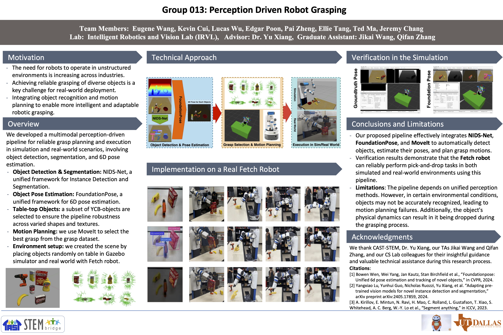

[](https://youtu.be/jBX4foN34wg)

---

## Main Referred Methods

- **Object 6D Pose Estimation:** [FoundationPose](https://github.com/NVlabs/FoundationPose)
- **Object Detection and Segmentation:** [NIDS-Net](https://github.com/IRVLUTD/NIDS-Net)
- **Fetch Robot ROS Components for IRVL Lab:** [fetch_ros_IRVL](https://github.com/IRVLUTD/fetch_ros_IRVL)
- **Sim & Real Grasping Scene Generation & Implementation:** [SceneReplica](https://github.com/IRVLUTD/SceneReplica)

---

## Contents

- [CAST-STEM 2025 Summer Camp Project](#cast-stem-2025-summer-camp-project)
  - [Main Referred Methods](#main-referred-methods)
  - [Contents](#contents)
  - [Prerequisites](#prerequisites)
      - [1. Git](#1-git)
      - [2. Conda Environment Manager](#2-conda-environment-manager)
      - [3. Code Editor (Visual Studio Code for example)](#3-code-editor-visual-studio-code-for-example)
  - [Environment Setup (Docker)](#environment-setup-docker)
      - [1. Clone the Repository](#1-clone-the-repository)
      - [2. Build the Docker Image](#2-build-the-docker-image)
      - [3. Run and Enter the Docker Container](#3-run-and-enter-the-docker-container)
      - [4. Setup the Environment in the Docker Container](#4-setup-the-environment-in-the-docker-container)
        - [4.1 Compile the ROS Workspace (if you have not done so)](#41-compile-the-ros-workspace-if-you-have-not-done-so)
        - [4.2 Setup the Conda Environment](#42-setup-the-conda-environment)
          - [4.2.1 Create the conda environment:](#421-create-the-conda-environment)
          - [4.2.2 Install the fetch\_grasp package](#422-install-the-fetch_grasp-package)
          - [4.2.3 Install FoundationPose:](#423-install-foundationpose)
          - [3.2.3 Install NIDS-Net](#323-install-nids-net)
        - [4.3 Download the Datasets](#43-download-the-datasets)
        - [4.4 Create a Symbolic Link for the Models](#44-create-a-symbolic-link-for-the-models)
  - [Objects used in the Project](#objects-used-in-the-project)
  - [Example Usage](#example-usage)
      - [1. Run, Enter and Stop the Docker container:](#1-run-enter-and-stop-the-docker-container)
      - [2. Run the SAM2 Segmentation (Mannual Segmentation)](#2-run-the-sam2-segmentation-mannual-segmentation)
      - [3. Run the NIDS-Net Segmentation](#3-run-the-nids-net-segmentation)
      - [4. Run the FoundationPose](#4-run-the-foundationpose)
      - [5. Run the FoundationPose on NIDS-Net Segmentation Results](#5-run-the-foundationpose-on-nids-net-segmentation-results)
      - [6. Run the Demos in Gazebo Simulation](#6-run-the-demos-in-gazebo-simulation)
        - [6.1 Prepare the Fetch Gazebo Simulation](#61-prepare-the-fetch-gazebo-simulation)
        - [6.2 Terminal 5: Run the Fetch Grasping Simulation with Groundtruth Poses](#62-terminal-5-run-the-fetch-grasping-simulation-with-groundtruth-poses)
        - [6.3 Terminal 5: Run the Fetch Grasping Simulation with NIDS-Net and FoundationPose](#63-terminal-5-run-the-fetch-grasping-simulation-with-nids-net-and-foundationpose)
        - [6.4 Terminal 5: Run the Image\_Listener](#64-terminal-5-run-the-image_listener)
  - [Project Schedule](#project-schedule)
    - [Week 1: Basic Knowledge Preparation](#week-1-basic-knowledge-preparation)
      - [1. Slides](#1-slides)
      - [2. Further Readings](#2-further-readings)
      - [3. Useful Resources](#3-useful-resources)
    - [Week 2: Hands-on Practice for ROS, 6D Pose Estimation, and Fetch Gazebo](#week-2-hands-on-practice-for-ros-6d-pose-estimation-and-fetch-gazebo)
      - [1. Slides](#1-slides-1)
      - [2. Practice](#2-practice)
      - [2. Useful Resources](#2-useful-resources)
    - [Week 3: Fetch Gazebo Simulation](#week-3-fetch-gazebo-simulation)
      - [1. Fetch Grasping Demo](#1-fetch-grasping-demo)
      - [2. SceneReplica Reimplementation](#2-scenereplica-reimplementation)
    - [Week 4: Integrate FoundationPose, NIDS-Net with Fetch Gazebo Simulation](#week-4-integrate-foundationpose-nids-net-with-fetch-gazebo-simulation)
      - [1. Prerequisites](#1-prerequisites)
      - [2. Get RGBD Images and CameraInfo from ROS topics](#2-get-rgbd-images-and-camerainfo-from-ros-topics)
      - [3. Run FoundationPose on the Saved RGBD Images](#3-run-foundationpose-on-the-saved-rgbd-images)
      - [4. NIDS-Net: Run Segmentation on the Published RGB Image](#4-nids-net-run-segmentation-on-the-published-rgb-image)
    - [Week 5: Run Grasping on Real Fetch Robot](#week-5-run-grasping-on-real-fetch-robot)
      - [1.1 Make the Fetch Desktop ROS work as a ROS client](#11-make-the-fetch-desktop-ros-work-as-a-ros-client)
      - [1.2 Adjust the Fetch Robot for Safe Grasping](#12-adjust-the-fetch-robot-for-safe-grasping)
      - [1.4 Place the target objects (e.g., YCB Cracker) on the table.](#14-place-the-target-objects-eg-ycb-cracker-on-the-table)
      - [1.3 Run the Grasping on the Real Fetch Robot](#13-run-the-grasping-on-the-real-fetch-robot)
      - [1.4 More Results of the Grasping in Real-World](#14-more-results-of-the-grasping-in-real-world)
          - [1.4.1 Video Recording of the real grasping task](#141-video-recording-of-the-real-grasping-task)
          - [1.4.2 Screen Recording of the real grasping task](#142-screen-recording-of-the-real-grasping-task)
          - [1.4.3 Failure Case of the real grasping task](#143-failure-case-of-the-real-grasping-task)

## Prerequisites

#### 1. Git

- **Linux/Unix:**

```bash
sudo apt-get install git
```

- **Windows:**

  - Option One: [Github Desktop](https://desktop.github.com/).
  - Option Two: [Git for Windows](https://gitforwindows.org/).

- **MacOS:**

  - Option One: [Github Desktop](https://desktop.github.com/).
  - Option Two: [Homebrew](https://brew.sh/).

#### 2. Conda Environment Manager

Please refer to the official instruction [Installing Miniconda](https://docs.anaconda.com/miniconda/miniconda-install/) to install the miniconda.

#### 3. Code Editor (Visual Studio Code for example)

- You could install the Visual Studio Code (VSCode) from the [official website](https://code.visualstudio.com/).
- Recommended extensions for Python development in VSCode:
  - [Python](https://marketplace.visualstudio.com/items?itemName=ms-python.python)
  - [Pylance](https://marketplace.visualstudio.com/items?itemName=ms-python.vscode-pylance)
  - [Python Debugger](https://marketplace.visualstudio.com/items?itemName=ms-python.debugpy)
  - [Jupyter](https://marketplace.visualstudio.com/items?itemName=ms-toolsai.jupyter)

## Environment Setup (Docker)

#### 1. Clone the Repository

```bash
# Clone the repository and enter the project directory
git clone https://github.com/JWRoboticsVision/CAST-STEM-2025.git && cd CAST-STEM-2025
```

#### 2. Build the Docker Image

Follow below instructions to build the Docker image based on your operating system.

- For Linux, follow the [Linux Installation Guide](./docs/container_installation_linux.md).
- For Windows, follow the [Windows Installation Guide](./docs/container_installation_windows.md).

#### 3. Run and Enter the Docker Container

- Run the ros1-base container

```bash
bash ./docker/container_handler.sh run
```

- Enter the container

```bash
bash ./docker/container_handler.sh enter
```

#### 4. Setup the Environment in the Docker Container

##### 4.1 Compile the ROS Workspace (if you have not done so)

- Make sure you are not in the conda environment

```bash
conda deactivate
```

- Update rosdeps

```bash
rosdep update --rosdistro=$ROS_DISTRO
```

- Download the ROS packages and compile the workspace

```bash
# Go to the catkin workspace
mkdir -p ~/catkin_ws/src && cd ~/catkin_ws/src

# Fetch Robot ROS package
git clone -b ros1 https://github.com/IRVLUTD/fetch_ros_IRVL.git
# Fetch Gazebo Simulator
git clone -b gazebo11 https://github.com/ZebraDevs/fetch_gazebo.git
# Clone the urdf_tutorial
git clone -b ros1 https://github.com/ros/urdf_tutorial.git

# Compile the workspace
cd ~/catkin_ws && catkin_make -j$(nproc) -DPYTHON_EXECUTABLE=/usr/bin/python3
```

- Replace below files to make the Gazebo simulation load the Fetch robot URDF model correctly from the `fetch_ros_IRVL` package.

  - `fetch.gazebo.xacro` for `fetch_gazebo` package

```bash
cp ~/code/docker/config/fetch.gazebo.xacro ~/catkin_ws/src/fetch_gazebo/fetch_gazebo/robots/
```

##### 4.2 Setup the Conda Environment

###### 4.2.1 Create the conda environment:

The following commands will create a conda environment in the `~/code/.env` directory and activate it. This is useful for keeping the environment isolated and organized within the project directory.

```bash
# Go to the code directory
cd ~/code
# Create the conda environment
conda create --prefix $PWD/.env python=3.11 libffi=3.4 pyside2=5.15 -y

# Activate the conda environment
conda activate $PWD/.env
```

###### 4.2.2 Install the fetch_grasp package

- Install the PyTorch 2.1.1

```bash
python -m pip install torch==2.1.1 torchvision==0.16.1 --index-url https://download.pytorch.org/whl/cu118 --no-cache-dir
```

- Install the dependencies

```bash
python -m pip install -r requirements.txt --no-cache-dir
```

- Install the fetch_grasp package

```bash
python -m pip install -e source/fetch_grasp --no-cache-dir
```

- Download SAM2 checkpoint:

```bash
wget https://github.com/ultralytics/assets/releases/download/v8.3.0/sam2.1_t.pt -O ./checkpoints/sam2.1_t.pt
```

###### 4.2.3 Install FoundationPose:

Download the `FoundationPose.zip` file from [box](https://utdallas.box.com/s/mmg01ce4stg1txoauovy7j36fa2mbwsi) and extract it to the `./third-party` directory.

```bash
bash scripts/install_foundationpose.sh
```

###### 3.2.3 Install NIDS-Net

Download the `NIDS-Net.zip` file from [box](https://utdallas.box.com/s/l90nf1e2luem7rtlf52g1lzwrh9uh19d) and extract it to the `./third-party` directory.

```bash
bash scripts/install_nidsnet.sh
```

##### 4.3 Download the Datasets

Download the zip files from [box](https://utdallas.box.com/s/affmfpptc04qkmyb532atjrqn5q9d53g) and extract them to the `~/code/datasets` directory. The datasets directory should look like this:

```
./datasets
├── final_scenes
├── grasp_data
├── models
├── pose_data
```

##### 4.4 Create a Symbolic Link for the Models

To load the models properly in Gazebo, we need to create a symbolic link for the models directory in the Gazebo model path. This allows Gazebo to find the models when launching the simulation.

```bash
# Go to the .gazebo directory
cd ~/.gazebo
# Remove the existing symbolic link (if exists)
rm -rf models
# Create a new symbolic link to the models directory in the datasets
ln -s ~/code/datasets/models
```

## Objects used in the Project

To make the grasping scene easier, we will use a subset of the [YCB objects](https://www.ycbbenchmarks.com/object-models/) for the tabletop scene.

| Object Models                                            | Grasping Data                                          |
| -------------------------------------------------------- | ------------------------------------------------------ |
| 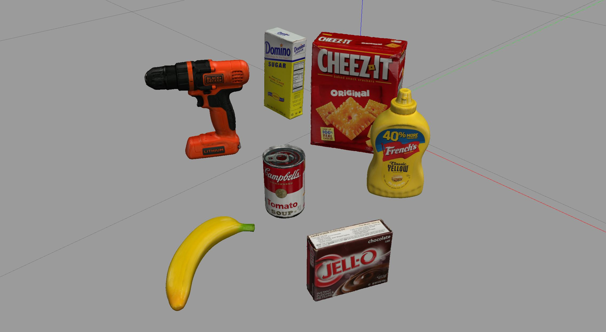 | 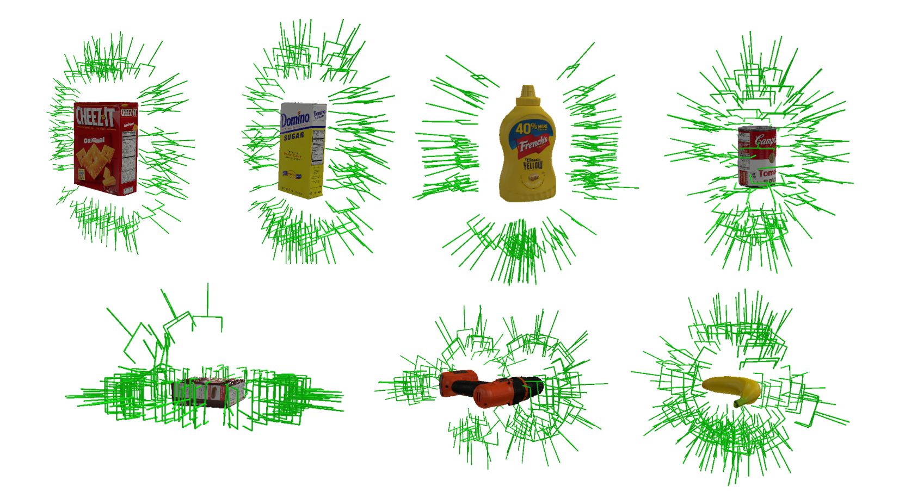 |

## Example Usage

#### 1. Run, Enter and Stop the Docker container:

- Run the Docker container:

```bash
bash docker/container_handler.sh run
```

- Enter the Docker container shell:

```bash
bash docker/container_handler.sh enter
```

- Stop the Docker container:

```bash
bash docker/container_handler.sh stop
```

#### 2. Run the SAM2 Segmentation (Mannual Segmentation)

The demo script will load the color image from `./demo/ros/color_image.png` and the user could segment the image using SAM2. The segmentation results will be saved under `./demo/ros`:

- `mask_image_sam2.png`: the segmentation mask image.
- `mask_image_sam2_vis.png`: the visualization of the segmentation mask.
- `sam2_prompts.yaml`: the prompts used for segmentation.

```bash
python ~/code/tools/test_sam2_segmentation.py
```

- `Ctrl + Left Click`: prompt positive points.
- `Ctrl + Right Click`: prompt negative points.
- `Esc`: exit the segmentation toolkit.
- `Add Mask`: add current segmentation mask with shown label.
- `Remove Mask`: remove last added mask.
- `Save Mask`: save the current segmentation mask to `./demo/ros/mask_image.png`.

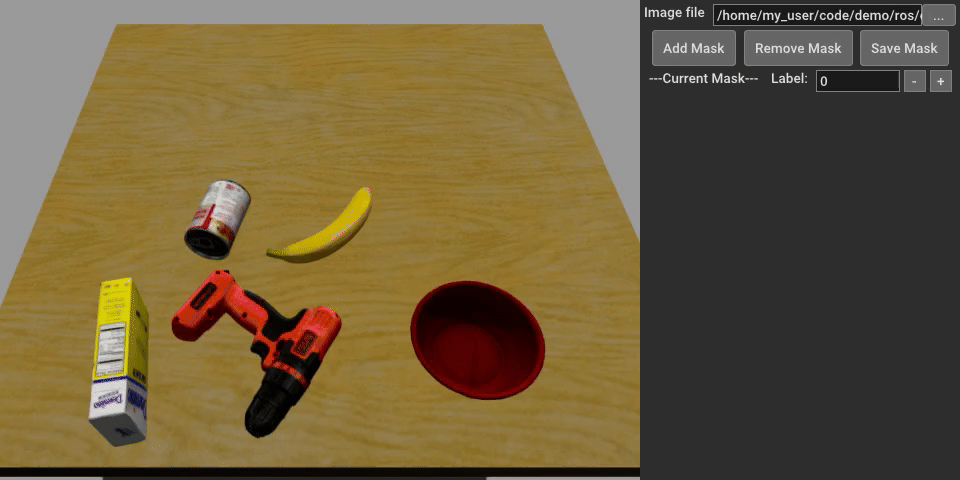

#### 3. Run the NIDS-Net Segmentation

The demo script will load the color image from `./demo/ros/color_image.png` and segment the objects in the image using NIDS-Net. The segmentation results will be saved under `./demo/ros/`:

- `mask_image_nidsnet.png`: the segmentation mask image.
- `mask_image_nidsnet_vis.png`: the visualization of the segmentation mask.
- `nidsnet_class_names.yaml`: the mapping of labels to class names in the segmentation mask.

```bash
python ~/code/tools/test_nidsnet.py
```

| Color Image                               | Segmentation Mask Visual                             |
| ----------------------------------------- | ---------------------------------------------------- |
| 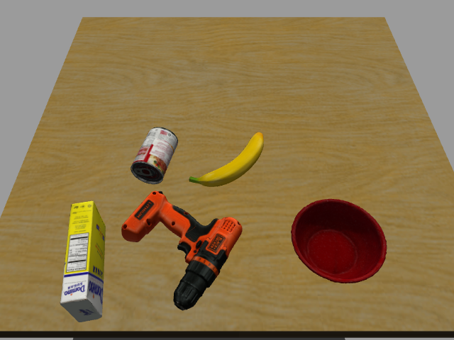 | 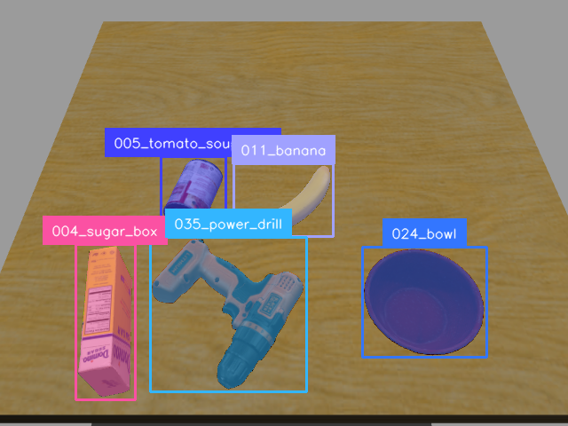 |

#### 4. Run the FoundationPose

The demo script will load the inputs from `./demo/ros/` and estimate the 6D pose of target object `035_power_drill` using FoundationPose. Results will be saved under `./demo/ros/`:

- `ob_in_cam_vis.png`: the rendered pose of the object in the camera frame.
- `ob_in_cam.txt`: the estimated 6D pose of the object in the camera frame.

```bash
python ~/code/tools/test_foundationpose.py
```

| Segmentation Mask                                            | Rendered Pose                               |
| ------------------------------------------------------------ | ------------------------------------------- |
| 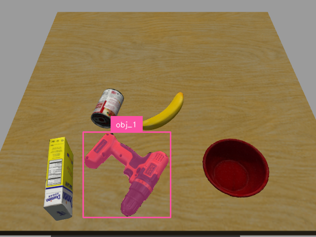 | 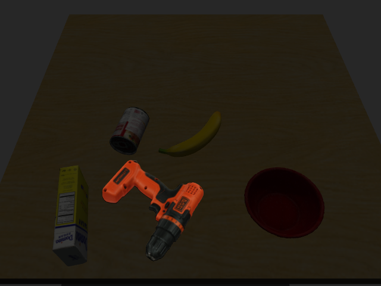 |

#### 5. Run the FoundationPose on NIDS-Net Segmentation Results

The demo script will load the NIDS-Net segmentation results from `./demo/ros/` and estimate the 6D pose of labeled objects in the mask. Results will be saved under `./demo/ros/`:

- `ob_in_cam_poses_vis.png`: the rendered poses of the objects in the camera frame.
- `ob_in_cam_poses.npz`: the estimated 6D poses of the objects in the camera frame.

```bash
python ~/code/tools/test_nidsnet_and_fdpose.py
```

| Segmentation Mask                                    | Rendered Pose                                     |
| ---------------------------------------------------- | ------------------------------------------------- |
|  | 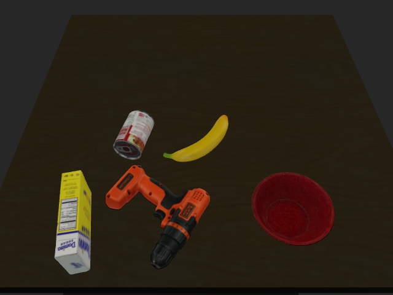 |

#### 6. Run the Demos in Gazebo Simulation

##### 6.1 Prepare the Fetch Gazebo Simulation

- **Terminal 1:** Start the ROS master (if not already running)

```bash
roscore
```

- **Terminal 2:** Start the Fetch Gazebo simulation

```bash
roslaunch ~/code/config/launch/just_robot.launch
```

- **Terminal 3:** Start the MoveIt Planning Interface

```bash
roslaunch ~/code/config/launch/moveit_sim.launch
```

- **Terminal 4:** Start Rviz

```bash
rviz -d ~/code/config/rviz/grasp_sim.rviz
```

##### 6.2 Terminal 5: Run the Fetch Grasping Simulation with Groundtruth Poses

```bash
python ~/code/tools/fetch_grasp_sim.py --pose_method gazebo
```

The `fetch_grasp_sim.py` script will execute below tasks:

- Lift the Fetch robot's torso and adjust the camera to look at the tabletop.
- Create the tabletop scene in Gazebo with randomly placed YCB Cracker object.
- Setup the MoveIt Scene and do motion planning for each object.
- Once a `FULL grasp` is found, the Fetch robot will execute the grasping motion in below order:
  - Reching to the target object.
  - Grasp the object with the gripper.
  - Move the gripper up to lift the object.
  - Open the gripper to drop the object.
  - Move the gripper back to the default position.

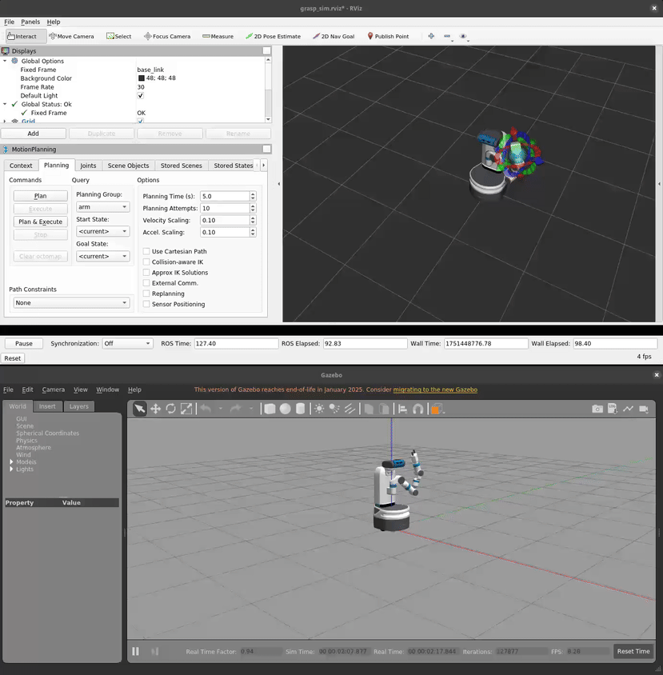

##### 6.3 Terminal 5: Run the Fetch Grasping Simulation with NIDS-Net and FoundationPose

The `fetch_grasp_sim.py` script will estimate the 6D poses of the objects using NIDS-Net and FoundationPose instead of the Gazebo simulation ground truth poses.

```bash
python ~/code/tools/fetch_grasp_sim.py --pose_method fdpose
```

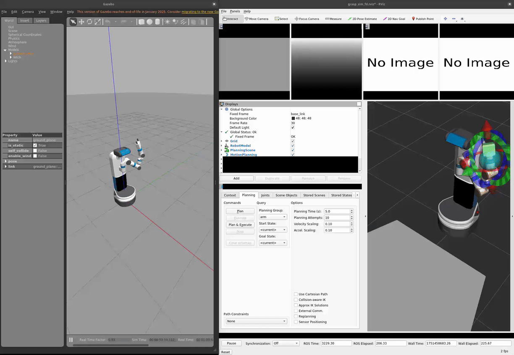

##### 6.4 Terminal 5: Run the Image_Listener

The `test_image_listenser.py` script will execute below tasks:

- Subscribe to the color and depth images published by the Fetch Gazebo simulation.
- Segment the objects in the color image using NIDS-Net.
- Estimate the 6D poses of the objects using FoundationPose.
- Publish the rendered poses and segmentation visuals via ROS topics.

```bash
# Place objects on the table in Gazebo simulation
python ~/code/tools/create_scene_sim.py

# Run the Image_Listener
python ~/code/tools/test_image_listenser.py
```

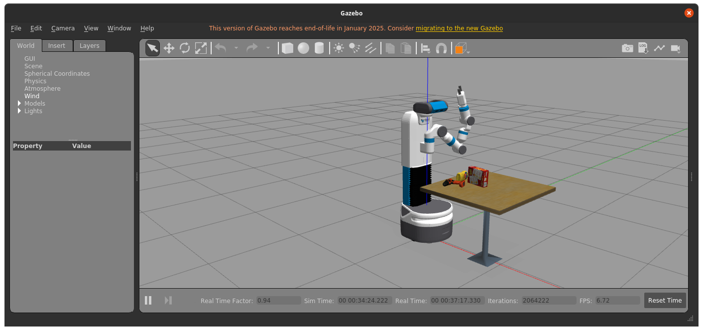
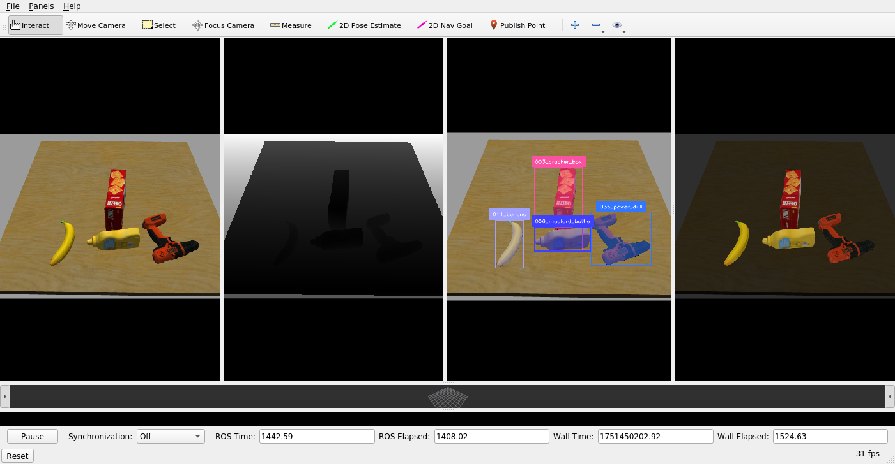

## Project Schedule

### Week 1: Basic Knowledge Preparation

#### 1. Slides

- [Pythion_Basics.ipynb](./notebooks/01_Python_Basics.ipynb)
  Introduce basics in Python, such as list, tuple, set, dictionary, class, function, loop, etc.
- [Numpy_Basics.ipynb](./notebooks/02_Python_Numpy.ipynb)
  Introduce basics in Numpy, such as array, matrix, operation, etc.
- [Pytorch_Basics.ipynb](./notebooks/06-1_Pytorch_Basics.ipynb)
  Introduce basics in Pytorch, such as tensor, operation, etc.
- [Computer_Vision_Basics.pdf](./docs/slides/01_Computer_Vision_Basics.pdf)
  - Practice 1: [CV_Transformation.ipynb](./notebooks/03-3_CV_Transformation.ipynb)
    How to apply the transformation on 3D points.
  - Practice 2: [CV_Deprojection.ipynb](./notebooks/03-1_CV_Deprojection.ipynb)
    How to depreject the 2D depth image to 3D points.
- [Introduction_to_ROS.pdf](./docs/slides/02_Introduction_to_ROS.pdf)
  Introduce the basic concepts and useful commands in ROS.
- [Introduction_to_6D_Pose_Estimation.pdf](./docs/slides/03_Introduction_to_6D_Pose_Estimation.pdf)
  Introduce the basic concepts of 6D pose estimation and FoundationPose.

#### 2. Further Readings

- [FoundationPose: Unified 6D Pose Estimation and Tracking of Novel Objects](https://arxiv.org/abs/2312.08344)
- [SAM: Segment Anything](https://arxiv.org/abs/2304.02643)
- [SAM 2: Segment Anything in Images and Videos](https://arxiv.org/pdf/2408.00714)
- [NIDS-Net: Adapting Pre-Trained Vision Models for Novel Instance Detection and Segmentation](https://arxiv.org/abs/2405.17859)
- [DINOv2: Learning Robust Visual Features without Supervision](https://arxiv.org/abs/2304.07193)

#### 3. Useful Resources

- Python basics https://pythonbasics.org/
- Numpy https://numpy.org/doc/stable/user/basics.html
- OpenCV https://docs.opencv.org/4.x/d6/d00/tutorial_py_root.html

### Week 2: Hands-on Practice for ROS, 6D Pose Estimation, and Fetch Gazebo

#### 1. Slides

- [06_ROS_Publish_Image.ipynb](./notebooks/06_ROS_Publish_Image.ipynb)
  Introduce how to publish images in ROS.
- [07_ROS_Subscribe_Image.ipynb](./notebooks/07_ROS_Subscribe_Image.ipynb)
  Introduce how to subscribe images in ROS.

#### 2. Practice

- Write a ROS node to publish images from the recordings.
- Write a ROS node to subscribe images and display them in a window.
- Write a ROS node to subscribe images published by the Fetch Gazebo simulation.
- Modify the FoundationPose code to:
  - detect object poses using the images published by the Fetch Gazebo simulation.
  - publish the detected poses to a ROS topic.
  - draw the detected poses on the images and publish the images to a ROS topic.

#### 2. Useful Resources

- [ROS Tutorials](http://wiki.ros.org/ROS/Tutorials)
- [ROS Python API](http://wiki.ros.org/rospy)
- ROS Messages
  - [ROS Image Message](https://docs.ros.org/en/noetic/api/sensor_msgs/html/msg/Image.html)
  - [ROS Pose Message](https://docs.ros.org/en/noetic/api/geometry_msgs/html/msg/Pose.html)
  - [ROS Pose Array Message](https://docs.ros.org/en/noetic/api/geometry_msgs/html/msg/PoseArray.html)
  - [ROS TF2](http://wiki.ros.org/tf2)
- [MoveIt 1 Tutorials](https://moveit.github.io/moveit_tutorials/) for ROS Noetic

### Week 3: Fetch Gazebo Simulation

In this week, we will focus on the Fetch Gazebo simulation. The goal is to use the Fetch robot in the Gazebo simulation environment to perform grasping tasks.

#### 1. Fetch Grasping Demo

Download and unzip the `my_demo.zip` file from [box](https://utdallas.box.com/s/puvnx931jzwk4o2bqrv5fnqnojzu80ar) and place it under the `./docker/ros/catkin_ws/src` directory.

- Run Docker container:

```bash
bash ./docker/container_handler.sh run ros1-user
```

- Enter the container:

```bash
bash ./docker/container_handler.sh enter ros1-user
```

- **Compile** the ROS workspace:

```bash
# Go to the catkin workspace
cd ~/catkin_ws && catkin_make -j$(nproc) -DPYTHON_EXECUTABLE=/usr/bin/python3
# Source the workspace
source ~/catkin_ws/devel/setup.zsh
```

- Link the models of my_demo to the Gazebo model path:

To load the models properly in Gazebo, we need to link the `my_demo` models to the Gazebo model path. This allows Gazebo to find the models when launching the simulation.

```bash
cd ~/.gazebo && ln -s ~/catkin_ws/src/my_demo/models models
```

- **Terminal 1:** Start the ROS master

```bash
roscore
```

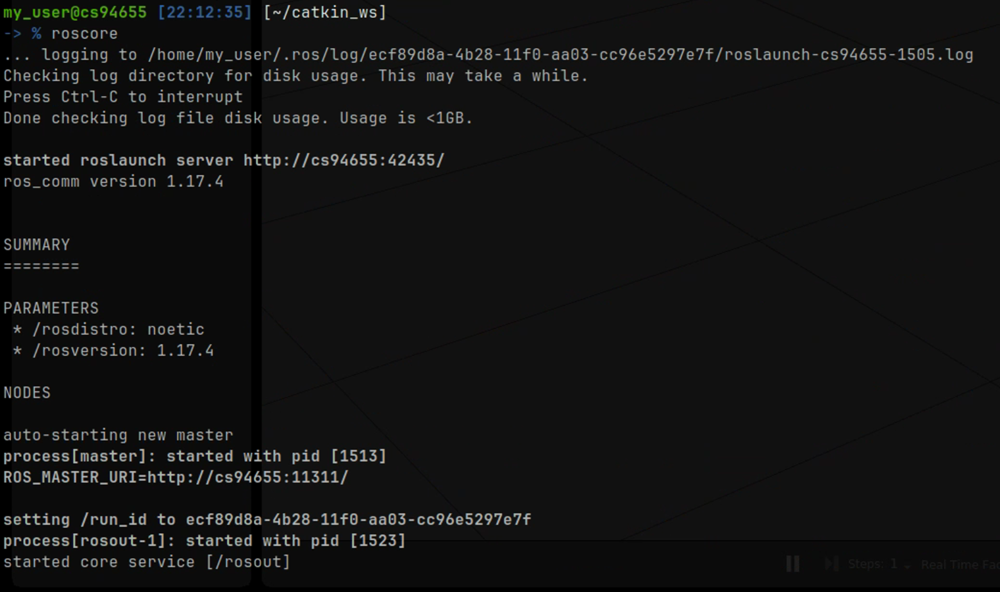

- **Terminal 2:** Start the Gazebo Simulation

Below launch file will start the Gazebo simulation environment with a simple scene containing a Fetch robot, a table and the YCB Cracker object.

```bash
roslaunch my_demo table_ycb.launch
```

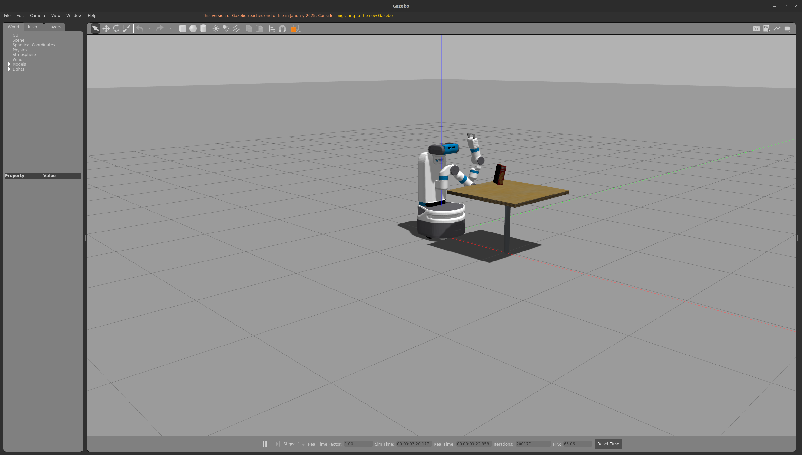

- **Terminal 3:** Launch the MoveIt Planning Interface

```bash
roslaunch fetch_moveit_config move_group.launch
```

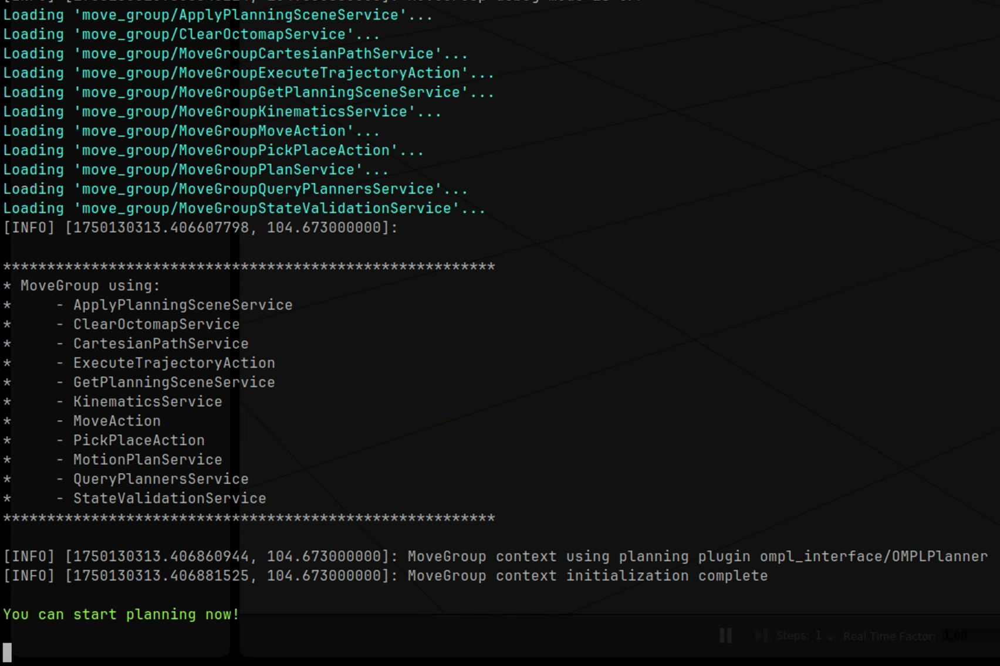

- **Terminal 4:** Start Rviz

The `fetch_gazebo.rviz` will display the color and depth images from the Fetch robot's cameras, the robot model, and the MoveIt PlanningScene.

```bash
rviz -d ${HOME}/code/config/rviz/fetch_gazebo.rviz
```

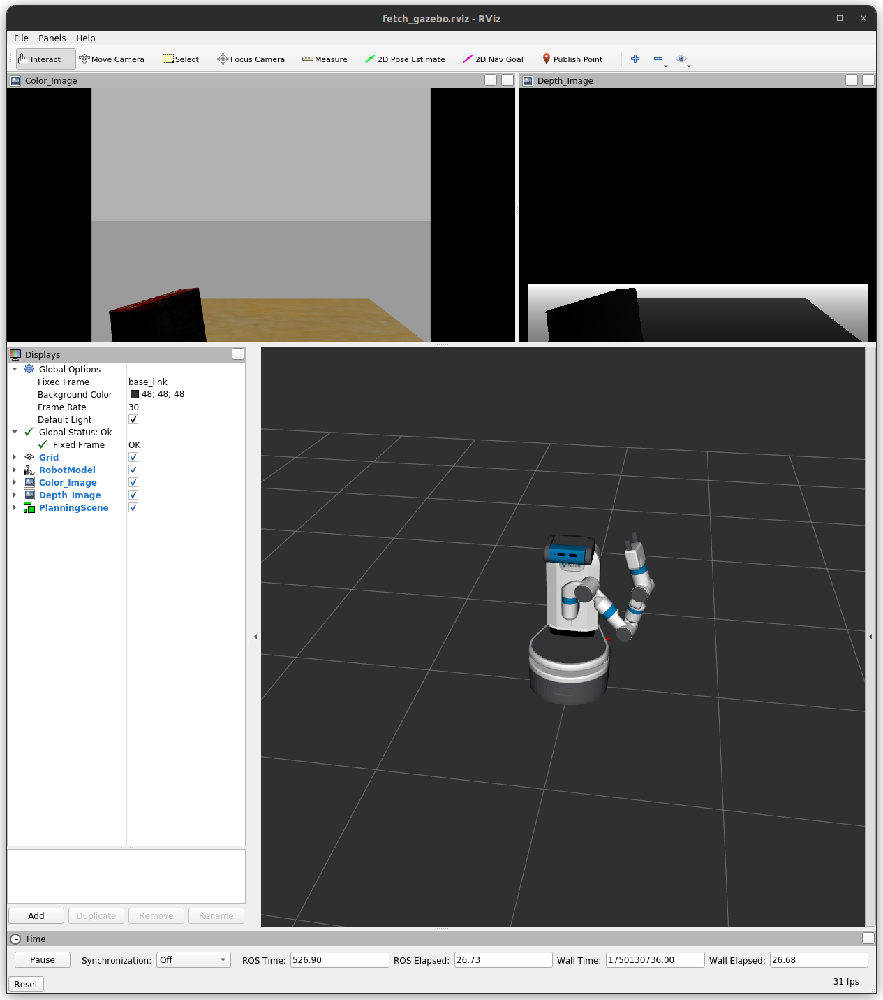

- **Terminal 5:** Run the Grasping

The `grasp_cracker.py` script will execute below tasks:

- Lift the Fetch robot's torso.
- Setup the PlanningScene
- Adjust the Fetch robot's camera to look at the tabletop.
- Get the cracker 6D pose directly from the Gazebo simulation.
- Load the grasp data for the cracker object.
- Plan the grasping motion using MoveIt.
  - First sort the grasps based on the distance to the gripper.
  - Then plan the grasping motion for each grasp, until a valid grasp is found.
- Execute the grasping motion.

```bash
cd ~/catkin_ws/src/my_demo/scripts && python grasp_cracker.py
```

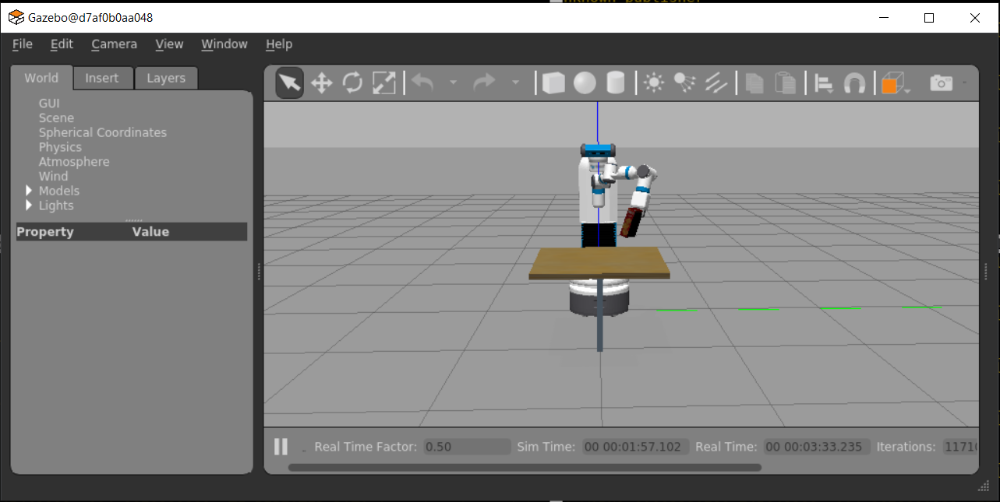

#### 2. SceneReplica Reimplementation

In this section, we will reimplement the [SceneReplica](https://github.com/IRVLUTD/SceneReplica) benchmarking using the Fetch robot in the Gazebo simulation environment.

1. Download the modified SceneReplica from [box](https://utdallas.box.com/s/0ueu09jzm0j9i9uk6ppfwv28ad7rw1hn).
2. Unzip the downloaded file and place it in the `third-party` directory.
3. Data Setup:
   Follow the instructions in the [SceneReplica Data Setup](https://github.com/IRVLUTD/SceneReplica/tree/main#data-setup) to set up the data for SceneReplica.

```
Datasets
   |--benchmarking
      |--models/
      |--grasp_data
         |--refined_grasps
            |-- fetch_gripper-{object_name}.json
         |--sgrasps.pk
      |--final_scenes
         |--scene_data/
            |-- scene_id_*.pk scene pickle files
         |--metadata/
            |-- meta-00*.mat metadata .mat files
            |-- color-00*.png color images for scene
            |-- depth-00*.png depth images for scene
         |--scene_ids.txt : selected scene ids on each line
```

4. Run the SceneReplica benchmarking in the Gazebo simulation environment using the Docker container.

- Run and Enter the Docker container:

```bash
bash docker/container_handler.sh run ros1-user
bash docker/container_handler.sh enter ros1-user
```

- Link the SceneReplica models to the Gazebo model path:

```bash
cd ~/.gazebo && rm models && ln -s ~/code/third-party/SceneReplica/Datasets/benchmarking/models
```

- **Terminal 1:** Start the ROS master (if not already running)

```bash
roscore
```

- **Terminal 2:** Start the Fetch Gazebo simulation with Just Robot

```bash
roslaunch ~/code/third-party/SceneReplica/launch/just_robot.launch
```

- **Terminal 3:** Start the MoveIt Planning Interface

```bash
roslaunch ~/code/third-party/SceneReplica/launch/moveit_sim.launch
```

- **Terminal 4:** Start Rviz

```bash
rviz -d ~/code/config/rviz/grasp_sim.rviz
```

- **Terminal 5:** Setup the desired scene in Gazebo
  Available scene ids: 10, 25, 27, 33, 36, 38, 39, 48, 56, 65, 68, 77, 83, 84, 104, 122, 130, 141, 148, 161

```bash
cd ~/code/third-party/SceneReplica/src && python setup_scene_sim.py --data_dir ../../../datasets
# Select the scene id you want to setup
# For example, to setup scene id 10
```

- **Terminal 6:** Run the Model-based Grasping

```bash
# Go to the SceneReplica source directory
cd ~/code/third-party/SceneReplica/src && python bench_model_based_grasping.py \
  --pose_method gazebo \
  --obj_order nearest_first \
  --data_dir ../../../datasets \
  --scene_idx 10
```

### Week 4: Integrate FoundationPose, NIDS-Net with Fetch Gazebo Simulation

In this week, we will integrate the FoundationPose and NIDS-Net with the Fetch Gazebo simulation environment.

#### 1. Prerequisites

Repeat steps till Terminal 3 as described in the [Fetch Gazebo Simulation](#2-scenereplica-reimplementation) section to set up the Fetch Gazebo simulation environment for Scene id **10**.

#### 2. Get RGBD Images and CameraInfo from ROS topics

In this practice, we will subscribe to the RGBD images and CameraInfo published by the Fetch Gazebo simulation and save them under `/datasets/tmp` for later use.

- Practice 1: get the color, depth images and cam_K from simulation.

Complete the code in `/notebooks/08_FoundationPoseROS.py` to get the RGBD images and CameraInfo from the subscribed ROS topics published by the Fetch Gazebo simulation. The answer could be found [here](notebooks/08_FoundationPoseROS_answer.py).

| Color Image                                | Depth Image                                    |
| ------------------------------------------ | ---------------------------------------------- |
|  | 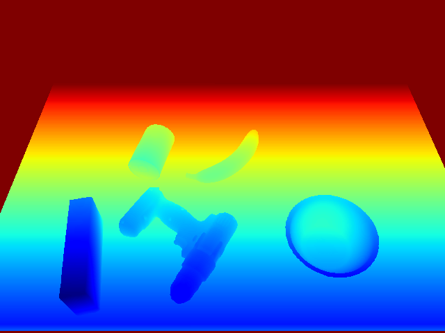 |

- Practice 2: Use SAM2 based segmentation toolkit to get the segment mask for **Power Drill**.

```bash
python tools/01_run_sam2_segmentation.py
```

The segmentation results will be saved under `/datasets/tmp`.

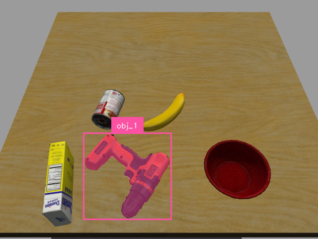

#### 3. Run FoundationPose on the Saved RGBD Images

Ensure you have installed the FoundationPose as described in the [Environment Setup](#environment-setup-docker) section.

Now, we have the inputs ready, we can run the FoundationPose to get the 6D poses of the objects in the scene.

- **Notebook [05_FoundationPoseWrapper.ipynb](./notebooks/05_FoundationPoseWrapper.ipynb)**: Understand how to run FoundationPose to estimate the 6D poses of the objects in the scene. The notebook will guide you through the process of preparing the inputs, running the FoundationPose, and visualizing the results.

#### 4. NIDS-Net: Run Segmentation on the Published RGB Image

First, follow steps in [Run the Fetch Grasping in Gazebo Simulation](#6-run-the-fetch-grasping-in-gazebo-simulation) to create the Gazebo simulation environment with the Fetch robot and the YCB Cracker object. No grasping is needed in this practice.

**Next, finish the code** in [09_fdpose_and_nidsnet_sim.py](notebooks/09_fdpose_and_nidsnet_sim.py) with below tasks:

- Subscribe the color image, depth image and camera info from the Fetch Gazebo simulation: refer to [08_FoundationPoseROS_answer.py](notebooks/08_FoundationPoseROS_answer.py) to get the color, depth images and camera info.
- Run the NIDS-Net segmentation on the subscribed color image: refer to [tools/test_nidsnet.py](tools/test_nidsnet.py) to run the NIDS-Net segmentation on the color image.
- Run the FoundationPose on the NIDS-Net segmentation results: refer to [tools/test_nidsnet_and_fdpose.py](tools/test_nidsnet_and_fdpose.py) to run the FoundationPose on the NIDS-Net segmentation results.
- The estimated poses by FoundationPose should be close to the ground truth poses of the objects in the scene.
- The answer could be found [here](notebooks/09_fdpose_and_nidsnet_sim_answer.py).

The results will be saved under `/datasets/tmp/fdpose_nidsnet_sim`.

| Object Poses by FoundationPose                                     | Object Poses by Gazebo (GroundTruth)                           |
| ------------------------------------------------------------------ | -------------------------------------------------------------- |
|  | 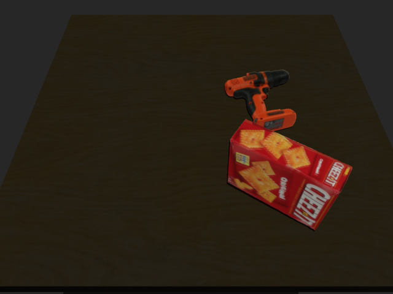 |

### Week 5: Run Grasping on Real Fetch Robot

#### 1.1 Make the Fetch Desktop ROS work as a ROS client

```bash
source ~/code/docker/source_env.sh
```

In our Lab ROS environment, the Fetch robot runs as the ROS master, and the desktop computer runs as a ROS client. To ensure the desktop computer can communicate with the Fetch robot, we need to source the environment variables every time we open a new terminal. This sets the `ROS_MASTER_URI` to the Fetch robot's IP address and the `ROS_IP` to the desktop computer's IP address.

The illustration of the ROS master and client relationship:


#### 1.2 Adjust the Fetch Robot for Safe Grasping

- Move the Fetch robot to a safe position, such as front of the table.
- Set the gripper to a proper position.
- Lift the torso to a proper height.
- Adjust the camera to look at the tabletop.

#### 1.4 Place the target objects (e.g., YCB Cracker) on the table.

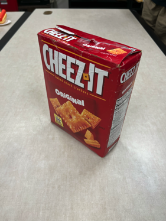

#### 1.3 Run the Grasping on the Real Fetch Robot

- **Terminal 1:** Start the ROS master (if not already running)

```bash
source ~/code/docker/source_env.sh && roscore
```

- **Terminal 2:** Start the MoveIt Planning Interface

```bash
source ~/code/docker/source_env.sh && roslaunch ~/code/config/launch/moveit_real.launch
```

- **Terminal 3:** Start Rviz

```bash
source ~/code/docker/source_env.sh && rviz -d ~/code/config/rviz/grasp_real.rviz
```

- **Terminal 4:** Run the Fetch Grasping in Real

```bash
source ~/code/docker/source_env.sh && python ~/code/tools/fetch_grasp_real.py
```

The `fetch_grasp_real.py` script to execute the grasping. The script will execute below tasks:

- Lift the Fetch robot's torso and adjust the camera to look at the tabletop.
- The NIDS-Net will detect and segment the observed objects in the color image.
- The FoundationPose will estimate the 6D poses of the segmented objects.
- Setup the MoveIt Scene and do motion planning for each object.
- Once a `FULL grasp` is found, the Fetch robot will execute the planned grasping motion.

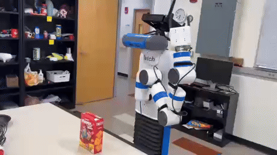

#### 1.4 More Results of the Grasping in Real-World

###### 1.4.1 Video Recording of the real grasping task


###### 1.4.2 Screen Recording of the real grasping task


###### 1.4.3 Failure Case of the real grasping task

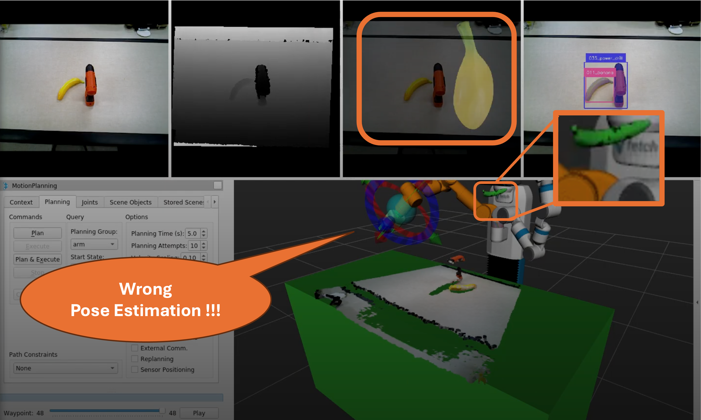
